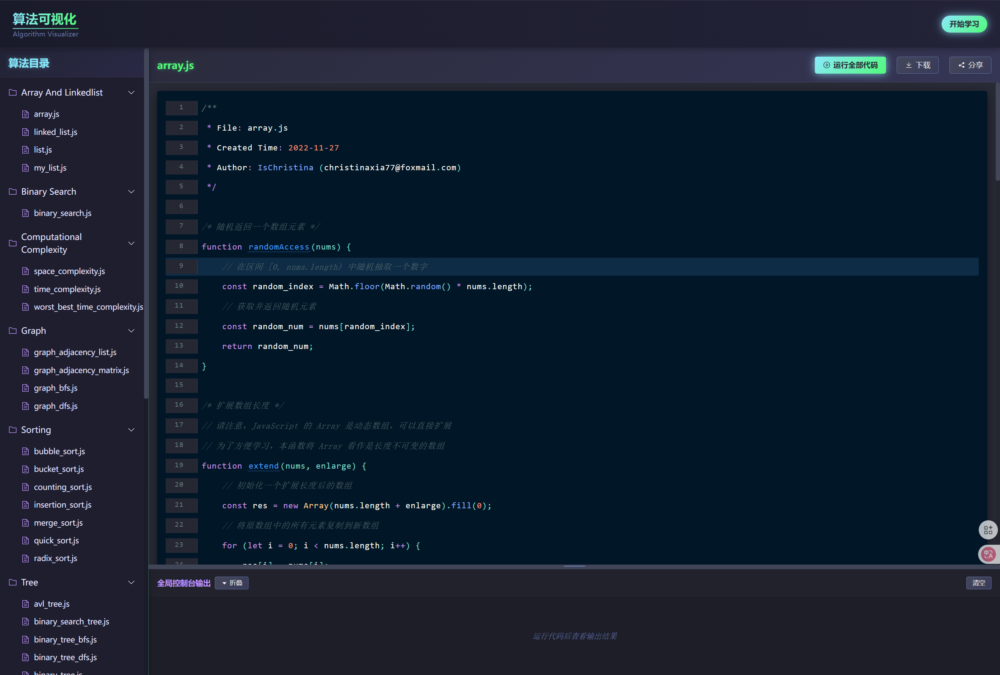
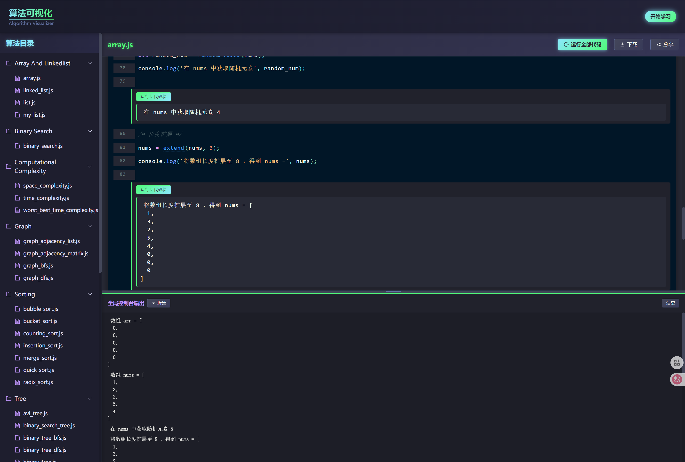
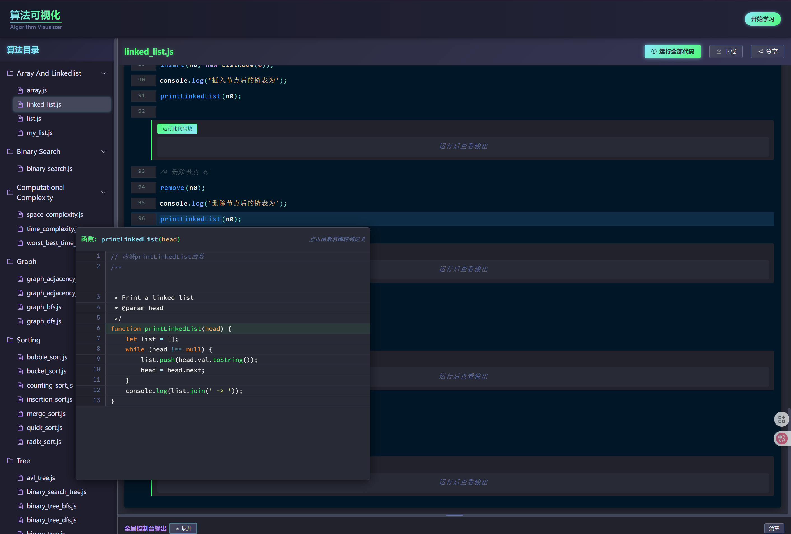

# 算法可视化器

一个用于展示和解释各种经典算法实现和运行过程的可视化工具。本项目基于Vue 3和Vite构建，帮助用户直观理解各类算法的工作原理和执行过程。

## 项目灵感

本项目的灵感来源于为 [Hello 算法](https://github.com/krahets/hello-algo) 开源书籍添加一个方便运行其中JavaScript算法代码的可视化界面。Hello 算法是一本动画图解、一键运行的数据结构与算法教程，支持多种编程语言。本可视化器旨在提供更直观的方式来理解和运行这些算法实现。

## 项目特性

- 交互式算法可视化界面
- 支持多种经典算法的展示
- 代码和可视化同步展示
- 易于理解的算法执行过程
- 响应式设计，适应不同设备

## 包含的算法

本项目包含以下几类算法：

- **数组和链表**: 数组操作、链表操作
- **二分查找**: 二分搜索算法
- **计算复杂度**: 时间复杂度、空间复杂度分析
- **图算法**: 邻接表、邻接矩阵、广度优先搜索(BFS)、深度优先搜索(DFS)
- **哈希**: 哈希表、哈希映射
- **堆**: 堆数据结构
- **搜索算法**: 线性搜索、哈希搜索、LeetCode经典问题
- **排序算法**: 冒泡排序、插入排序、归并排序、快速排序等
- **栈和队列**: 数组栈、链表栈、数组队列、链表队列、双端队列
- **树算法**: 二叉树、二叉搜索树、AVL树、树的广度优先和深度优先遍历

## 使用方法

```bash
# 安装依赖
npm install
# 或
pnpm install

# 启动开发服务器
npm run dev
# 或
pnpm dev

# 构建生产版本
npm run build
# 或
pnpm build
```

## 项目截图

### 截图1: 主界面


### 截图2: 算法执行过程


### 截图3: 代码查看器


## 项目结构

- `src/components`: Vue组件
- `src/views`: 页面视图
- `src/scripts/chapters`: 按章节组织的算法实现
- `src/router`: 路由配置
- `src/assets`: 静态资源
- `src/utils`: 工具函数

## 贡献指南

欢迎贡献新的算法实现或改进现有算法。请确保新添加的算法包含详细注释，解释核心步骤和原理。
